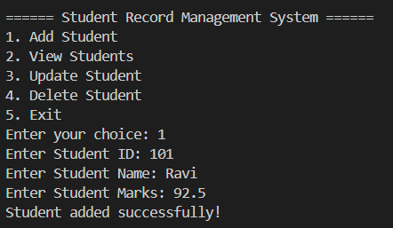

# Student Record Management System

A simple Java command-line application to perform CRUD (Create, Read, Update, Delete) operations on student records.

## 🚀 Features

- 📌 Add new student
- 📋 View all students
- ✏️ Update existing student details
- ❌ Delete a student
- 🧠 Practice with Java classes and ArrayList

## 🛠️ Tools & Technologies

- Java
- VS Code / IntelliJ Community Edition
- Command Line (CLI)

## 📂 Project Structure

StudentRecordSystem/
├── Student.java // Student class with id, name, marks
├── StudentManagementSystem.java // Menu-driven CLI logic
├── output.png // Optional: Screenshot of program output
└── README.md // This file

## 📸 Screenshot



## 🧑‍💻 How to Run

1. Open the project in your preferred IDE (VS Code or IntelliJ).
2. Compile the code:
    javac Student.java StudentManagementSystem.java
    ```
3. Run the program:
    java StudentManagementSystem
    ```

## 📝 Author

- 👩‍💻 [Khushbu Maurya](https://github.com/khushbumaurya26)

---

**Happy Coding! 👩‍💻👨‍💻**
